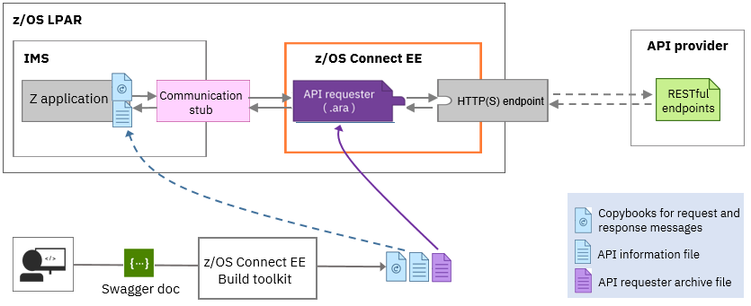

# Calling a REST API from IMS using z/OS Connect Enterprise Edition

You can call a REST API from an IMS™ applications by using IBM® z/OS® Connect Enterprise Edition (z/OS Connect EE) V3 as the solution.

## Scenario
You have an IMS COBOL application that needs to call a REST API to retrieve the contact information based on a person's last name.

## Program flow and architecture
This scenario uses the <b>API requester</b> feature in z/OS Connect EE to handle: 
* The API request from an IMS application
* Data conversion between byte arrays and XML
* The API response back to IMS

z/OS Connect EE provides a Build toolkit that lets you generate the required artifacts based on the REST API's Swagger document.  The generated files include:
* The API information file that describes the API name, the API path, exposed API methods and other information that is required to communicate with the <b>communication stub</b>. 
The communication stub is provided with z/OS Connect EE and must be configured on IMS for communication with the z/OS Connect EE server. 
* The copybooks that contain the language structures of the request and response messages. 
* An API requester archive (.ara) file that needs to be deploy to the z/OS Connect EE server. 

To call the REST API, your IMS application must first include the generated API information file and the request and response message copybooks. You can then specify the content for the request, retrieve the response, and, if an error occurs with the call, identify where the error occurs to help take the appropriate remedial action.

## Technology demonstrated
* <strong>z/OS Connect EE V3/open beta</strong>: its API requester feature and Build toolkit 

For a tutorial on the end-to-end workflow based on a REST API created from the IMS phonebook sample application (IVTNO), 
see [Calling a REST API from an IMS or batch application](https://www.ibm.com/support/knowledgecenter/SS4SVW_3.0.0/com.ibm.zosconnect.doc/scenarios/ims_apiReq_intro.html).

